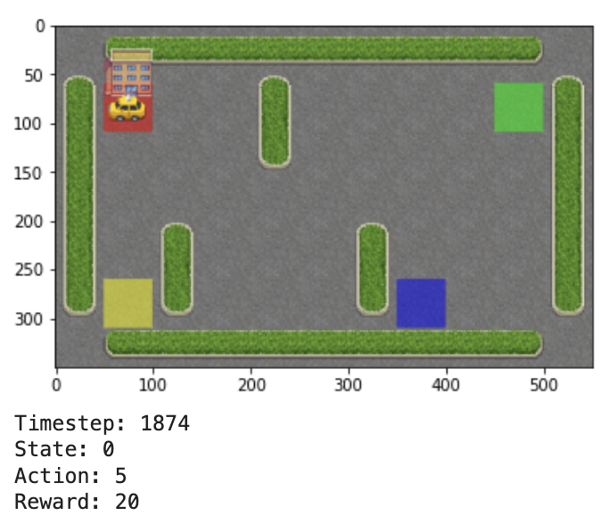

# Model-Free Reinforcement Learning

In this section, we explore interactive learning algorithms by implementing a game environment. We investigate how intelligent movement within the environment compares to random movement in achieving optimal outcomes, specifically focusing on transporting a passenger to their desired destination.

## Game Environment Description

The environment consists of a yellow taxi that needs to pick up a passenger from one location and drop them off at another. The taxi follows these rules:
1. The driver must prioritize getting passengers to their destination in the shortest time possible.
2. The driver must ensure passengers are dropped off at the correct destination.

### Rewards and Penalties

- **Reward**: +20 for successfully dropping a passenger at their correct destination.
- **Penalty**: -10 for dropping a passenger at the wrong destination.
- **Penalty**: -1 for each movement that does not contribute to reaching a goal.
- **Penalty**: -1 for colliding with walls, with the taxi remaining in place.

The taxi can perform six actions:
- Move up
- Move left
- Move right
- Move down
- Pick up a passenger
- Drop off a passenger

- **Locations**: `R`, `G`, `Y`, `B` are locations where passengers can be picked up or dropped off.
- **Indicators**: Blue represents the current location of the passenger, and purple represents the passenger's destination.
- **Taxi Colors**: Yellow indicates the taxi is empty, and green indicates the taxi is occupied.

To implement the taxi driver problem in Python, we first install `gym` and load the necessary libraries, and load the game environment to see the action and state spaces. We observe:
- Action Space: Size 6
- State Space: Size 500

The 500 states correspond to an encoding of the taxi's location, the passenger's location, and the destination location. The 6 actions correspond to:
- 0 = South
- 1 = North
- 2 = East
- 3 = West
- 4 = Pickup
- 5 = Drop off

### A) Random Exploration without Q-Learning

Initially, we use a random exploration approach and implement a loop where the taxi moves randomly within the environment until a passenger is successfully delivered to the correct destination. 

When the Taxi environment is created, an initial Reward table, called `P`, is also created. This table functions like a matrix with states as rows and actions as columns. The dictionary structure is: `{action: [(probability, nextstate, reward, done)]}`.

1. The indices 0-5 correspond to the actions.
2. `nextstate` is the state resulting from taking the action at this index.
3. All movement actions have a -1 reward, and pickup/dropoff actions have a -10 reward in this particular state. If the taxi has a passenger and is at the correct destination, the dropoff action yields a reward of 20.
4. `done` indicates whether the passenger has been successfully dropped off at the right location.

Using the `P` table, the taxi navigates until it successfully delivers a passenger to the correct destination.

Visualizing the game environment:

Results show that the agent takes thousands of timesteps and makes numerous incorrect drop-offs to deliver just one passenger to the correct destination.

**Average Rewards per Move:**

**Average Number of Penalties per Episode:**

**Average Number of Timesteps per Trip:**

### B) Smart Exploration with Q-Learning

Next, we implement Q-Learning for the environment and compare the results with those from the random exploration approach.

Q-Learning allows the agent to use the environment's rewards to learn the best action to take in a given state. In the Taxi environment, the agent learns from the reward table `P`, receiving rewards for actions in the current state, and updates a Q-value to remember if an action was beneficial.

The agent decides whether to pick a random action or use the previous Q-values by comparing a random value (e.g., `random.uniform(0,1)`) to an epsilon value. Next, the maximum Q-value for actions corresponding to the `next_state` is calculated to update the Q-value.

Visualizing the game environment:

The Q-Learning algorithm significantly improves performance, taking only 16 timesteps to reach the goal.

**Average Rewards per Move:**

**Average Number of Penalties per Episode:**

**Average Number of Timesteps per Trip:**

